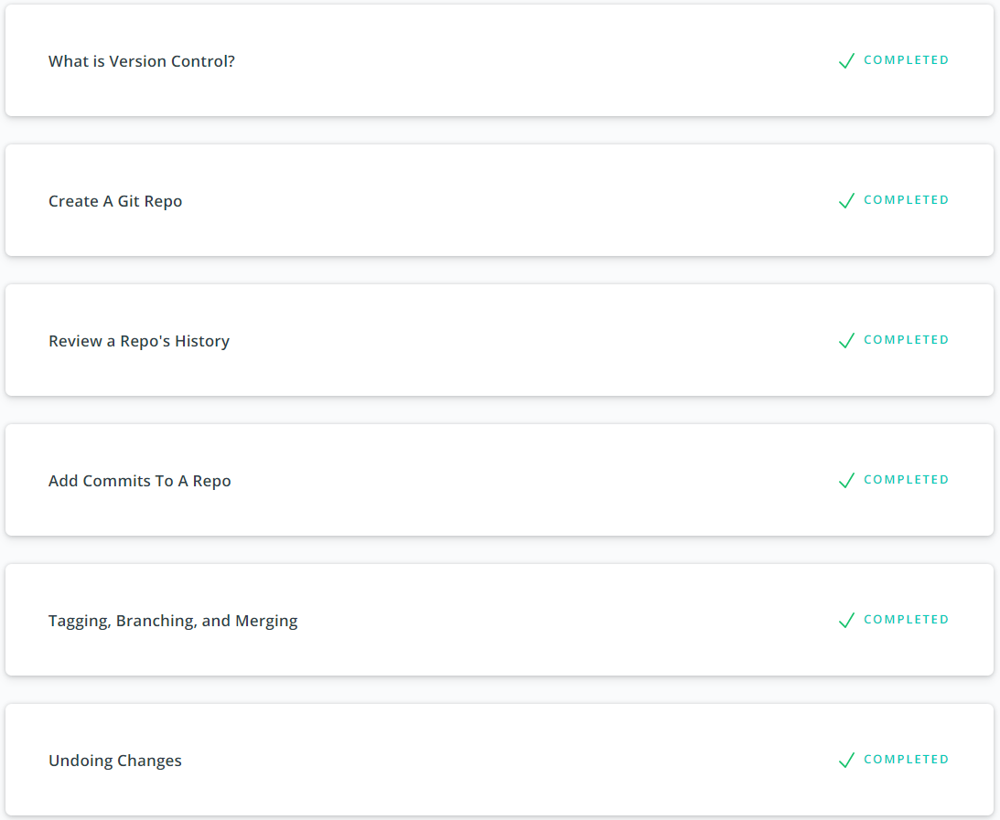
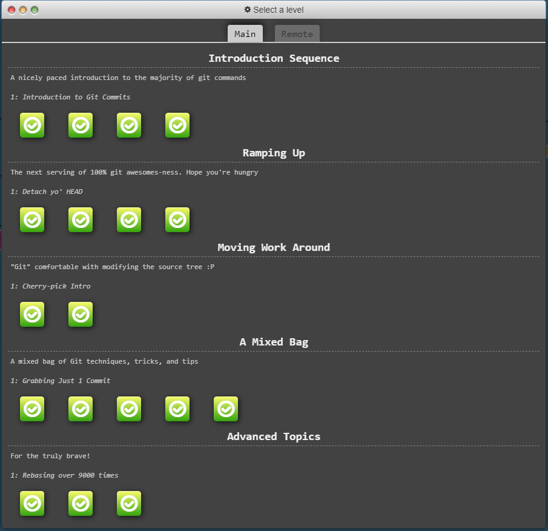

# kottans-frontend

## **Stage 0. Self-Study**

### ***General***

- [x] [Git Basics](#git-basics)
- [ ] [Linux CLI and Networking](#linux-cli-and-networking)
- [ ] [VCS, GitHub and Collaboration](#vcs-github-and-collaboration)

### ***Front-End Basics***

- [ ] Intro to HTML & CSS
- [ ] Responsive Web Design
- [ ] HTML & CSS Practice
- [ ] JavaScript Basics
- [ ] Document Object Model - practice

### ***Advanced Topics***

- [ ] Building a Tiny JS World (pre-OOP) - practice
- [ ] Object oriented JS - practice
- [ ] OOP exercise - practice
- [ ] Offline Web Applications
- [ ] Memory pair game — real project!
- [ ] Website Performance Optimization
- [ ] Friends App - real project!
  
___

## Git Basics

I understood that I hadn't realize all advantages of using GIT.  
This multipurpose tool helps us manage different versions of our project, track changes in any files and save them in the local or/and remote repositories.

The most difficult part of course was figuring out how to resolve merge conflicts.

Snapshots

